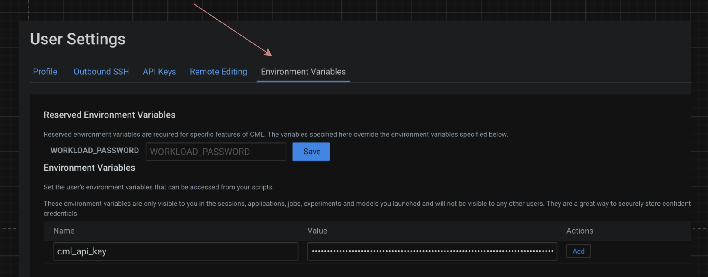

# repository for genai <to be expanded>

Main idea is to create a reusable framework for working with llm models
due to the fast pace of innovation.

Conceptual design is as follows

# general settings

This application can run in single mode or distributed mode.
To use distributed mode, please add the following extra settings.

## distributed mode extra settings
1. add the following cml runtime. (If you would like to use your own image. Refer to Runtime section for further steps)
**luismap/cml:pbjcuda12-v2.0**

2. add share storage for ray. go to project settings > advance > shared memory limit and set it to be around 64 GB.

# general settings
1. go to site administration > security, and check the setting for **Allow applications to be configured with unauthenticated access.**
   

1. go to site administration and add a new profile with **8 cpus** and **16GB RAM**

4. go to user settings > api keys > create api key. and add that key as an environment variable.

