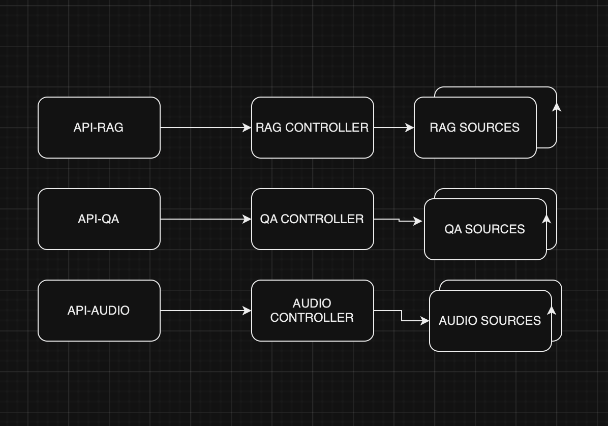

# repository for genai <to be expanded>

Main idea is to create a reusable framework for working with llm models
due to the fast pace of innovation.

Conceptual design is as follows

# general settings

This application can run in single mode or production mode.
To use production mode, please do the following.

1. add the following cml runtime. (If you would like to use your own image. Refer to Runtime section for further steps)
**luismap/cml:pbjcuda-V2.0**

2. 
